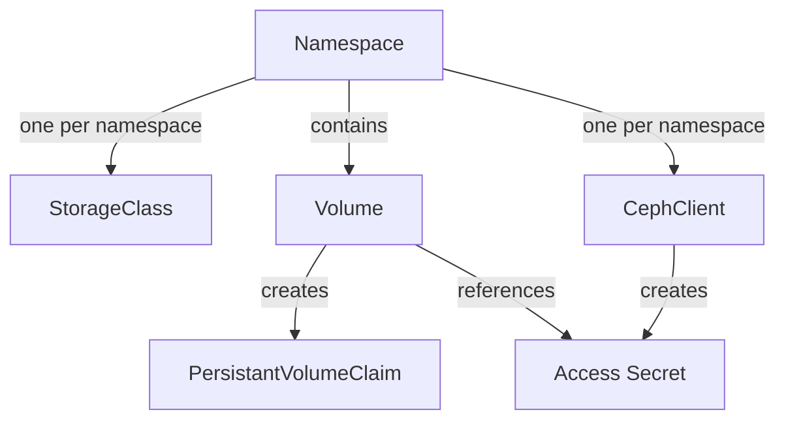
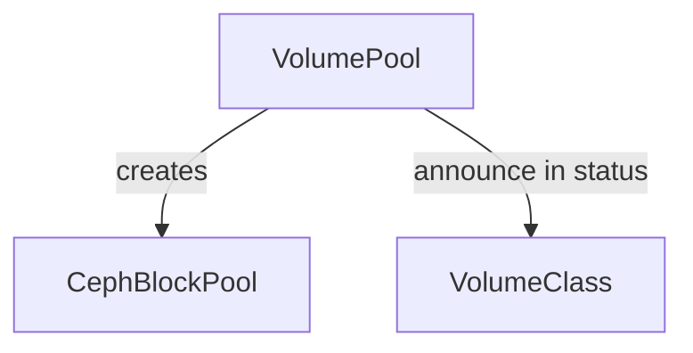

# cephlet

[](https://github.com/onmetal/cephlet/actions/workflows/test.yml)
[](https://makeapullrequest.com)
[](LICENSE)

`cephlet` is a Ceph based provider implementation of the [onmetal-api](https://github.com/onmetal/onmetal-api) `Volume` 
and `VolumePool` types.

## Description

> As Ceph does not support the creation of access secrets for each individual block devices, we chose to use Kubernetes `Namespace`s
as a tenant separation. All `Volumes` within a `Namespace` belong essentially to one tenant. 

The task of the `cephlet` is to create a Ceph block device for every `Volume` in a given namespace. Additionally,
for every `Namespace` an own `CephClient` and a corresponding `StorageClass` is created. The `StorageClass` is being used
to later create the `PersistantVolumeClaims` for a given `Namespace`. The access credentials which are being extracted
from the `CephClient` are stored in a `Secret` which is then referenced in the status of the `Volume`.

The graph blow illustrates the relationships between the entities created in the reconciliation flow of a `Volume`.



The `VolumePool` is indicating the consumer of the storage API where a `Volume` can be created. The `cephlet` is announcing
its pool as configured and accumulates all supported `VolumeClasses` in the pool status. The mapping between a `VolumePool`
and Ceph is done via the creation of a `CephBlockPool`.



## Getting Started
You’ll need a Kubernetes cluster to run against. You can use [KIND](https://sigs.k8s.io/kind) to get a local cluster for testing, or run against a remote cluster.
**Note:** Your controller will automatically use the current context in your kubeconfig file (i.e. whatever cluster `kubectl cluster-info` shows).

### Running on the cluster
1. Install Instances of Custom Resources:

```sh
kubectl apply -f config/samples/
```

2. Build and push your image to the location specified by `IMG`:
	
```sh
make docker-build docker-push IMG=<some-registry>/cephlet:tag
```
	
3. Deploy the controller to the cluster with the image specified by `IMG`:

```sh
make deploy IMG=<some-registry>/cephlet:tag
```

### Undeploy controller
UnDeploy the controller to the cluster:

```sh
make undeploy
```

## Contributing
// TODO(user): Add detailed information on how you would like others to contribute to this project

### How it works
This project aims to follow the Kubernetes [Operator pattern](https://kubernetes.io/docs/concepts/extend-kubernetes/operator/)

It uses [Controllers](https://kubernetes.io/docs/concepts/architecture/controller/) 
which provides a reconcile function responsible for synchronizing resources untile the desired state is reached on the cluster 

### Test It Out

Run your controller (this will run in the foreground, so switch to a new terminal if you want to leave it running):

```sh
make run
```

**NOTE:** You can also run this in one step by running: `make install run`

### Modifying the API definitions
If you are editing the API definitions, generate the manifests such as CRs or CRDs using:

```sh
make manifests
```

**NOTE:** Run `make --help` for more information on all potential `make` targets

More information can be found via the [Kubebuilder Documentation](https://book.kubebuilder.io/introduction.html)

## License

Copyright 2022.

Licensed under the Apache License, Version 2.0 (the "License");
you may not use this file except in compliance with the License.
You may obtain a copy of the License at

    http://www.apache.org/licenses/LICENSE-2.0

Unless required by applicable law or agreed to in writing, software
distributed under the License is distributed on an "AS IS" BASIS,
WITHOUT WARRANTIES OR CONDITIONS OF ANY KIND, either express or implied.
See the License for the specific language governing permissions and
limitations under the License.

