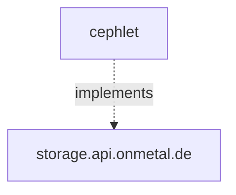

# Cephlet 

The `cephlet` project is a Ceph based provider implementation of the [onmetal-api](https://github.com/onmetal/onmetal-api)
types

Namely `cephlet` implements the [`Volume`](https://github.com/onmetal/onmetal-api/blob/main/apis/storage/v1alpha1/volume_types.go) 
and [`VolumePool`](https://github.com/onmetal/onmetal-api/blob/main/apis/storage/v1alpha1/volumepool_types.go) types. 
Additionally, it announces the available `VolumeClasses` which are supported by the `VolumePool` based on configured
criteria.

Further information about the architecture and concepts of the `cephlet` project can be found in the 
[architecture](/architecture) section.
