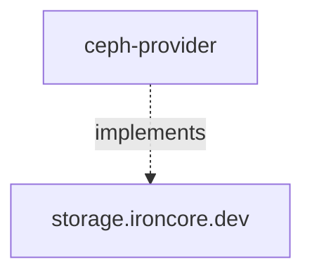

# Ceph Provider 

The `ceph-provider` project is a Ceph based provider implementation of the [ironcore](https://github.com/ironcore-dev/ironcore)
types

Namely `ceph-provider` implements the [`Volume`](https://github.com/ironcore-dev/ironcore/blob/main/apis/storage/v1alpha1/volume_types.go) 
and [`VolumePool`](https://github.com/ironcore-dev/ironcore/blob/main/apis/storage/v1alpha1/volumepool_types.go) types. 
Additionally, it announces the available `VolumeClasses` which are supported by the `VolumePool` based on configured
criteria.

Further information about the architecture and concepts of the `ceph-provider` project can be found in the 
[architecture](/architecture) section.
