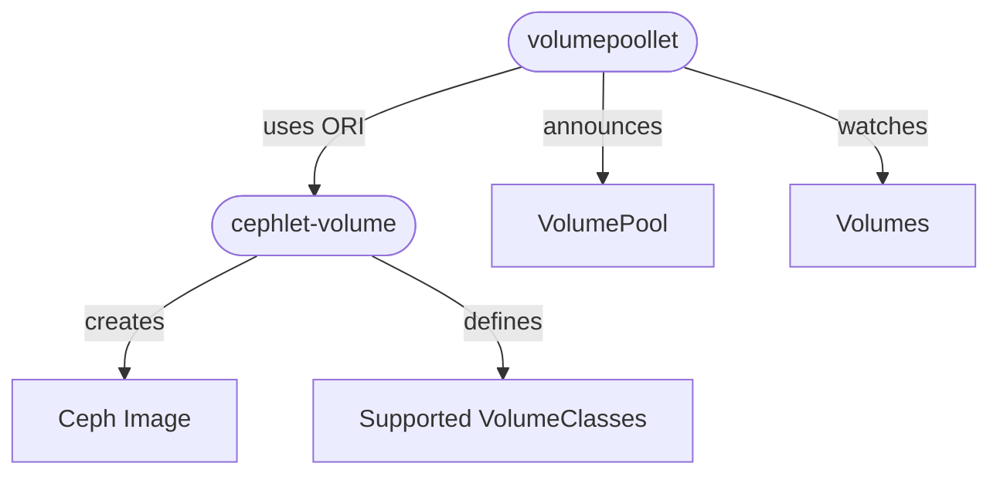
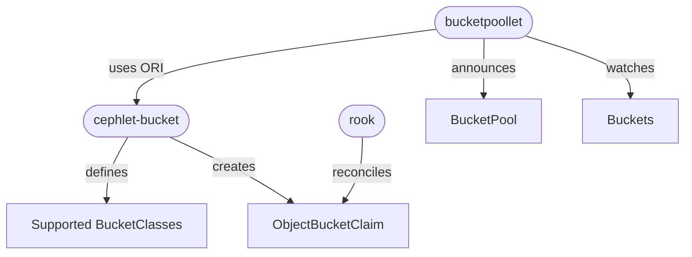

# Architecture

This section covers the core concepts of the `cephlet` project.

The `cephlet` is an implementor of the `onmetal runtime interface` (`ORI`) for `Volumes` and `Buckets`.
It consists of the `cephlet-volume` and `cephlet-bucket` in order to implement the [VolumeRuntime](https://github.com/onmetal/onmetal-api/blob/main/ori/apis/volume/v1alpha1/api.proto#L17-L23) respectively the [BucketRuntime](https://github.com/onmetal/onmetal-api/blob/main/ori/apis/bucket/v1alpha1/api.proto#L17-L23).

A `cephlet` is usually deployed along with a [poollet](https://github.com/onmetal/onmetal-api/tree/main/poollet).
A poollet resolves dependencies, e.g. an encryption secret, and calls with the consolidated resource the `cephlet`. 
The `cephlet` persists the required state and reconciles the resource in an asynchronous manner. 

## cephlet-volume

The `cephlet-volume` interacts directly with a defined `ceph cluster`. 
A `Volume` is provisioned by creating a `ceph image`. If needed, an image is created with a pre-defined `os image`.

The following diagram visualizes the interplay of the different components: 

## cephlet-bucket

The `cephlet-bucket` utilizes `rook` CRD's to back the onmetal `Bucket` resource.
Rook ensures that a `ObjectBucketClaim` (and an access secret) is being reconciled. 

The following diagram visualizes the interplay of the different components:

