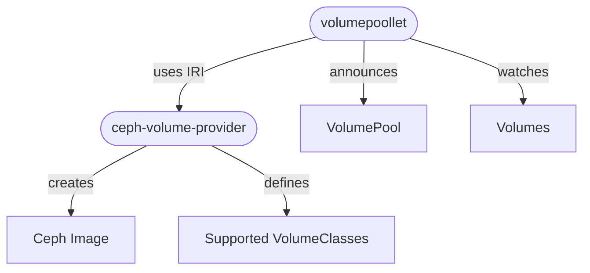
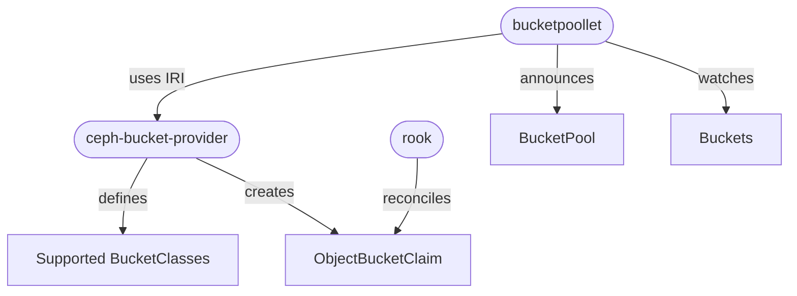

# Architecture

This section covers the core concepts of the `ceph-provider` project.

The `ceph-provider` is an implementor of the `ironcore runtime interface` (`IRI`) for `Volumes` and `Buckets`.
It consists of the `ceph-volume-provider` and `ceph-bucket-provider` in order to implement the [VolumeRuntime](https://github.com/ironcore-dev/ironcore/blob/main/iri/apis/volume/v1alpha1/api.proto#L17-L23) respectively the [BucketRuntime](https://github.com/ironcore-dev/ironcore/blob/main/iri/apis/bucket/v1alpha1/api.proto#L17-L23).

A `ceph-provider` is usually deployed along with a [poollet](https://github.com/ironcore-dev/ironcore/tree/main/poollet).
A poollet resolves dependencies, e.g. an encryption secret, and calls with the consolidated resource the `ceph-provider`. 
The `ceph-provider` persists the required state and reconciles the resource in an asynchronous manner. 

## ceph-volume-provider

The `ceph-volume-provider` interacts directly with a defined `ceph cluster`. 
A `Volume` is provisioned by creating a `ceph image`. If needed, an image is created with a pre-defined `os image`.

The following diagram visualizes the interplay of the different components: 

## ceph-bucket-provider

The `ceph-bucket-provider` utilizes `rook` CRD's to back the ironcore `Bucket` resource.
Rook ensures that a `ObjectBucketClaim` (and an access secret) is being reconciled. 

The following diagram visualizes the interplay of the different components:

