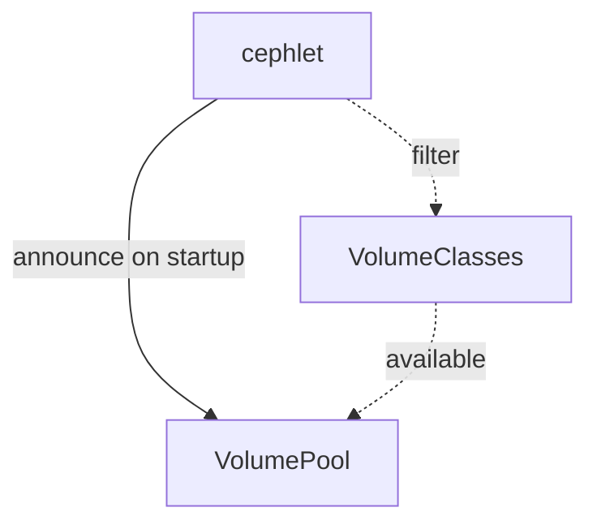
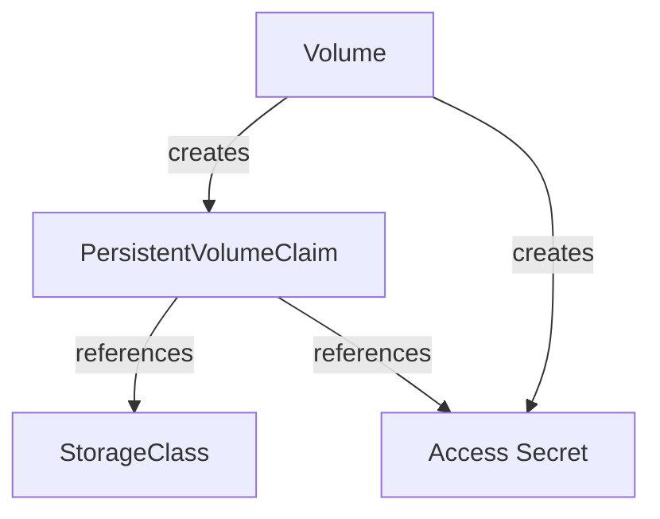
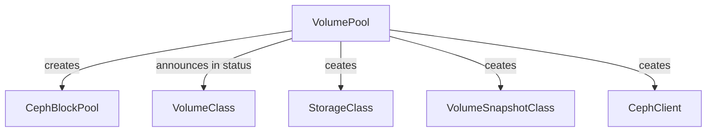
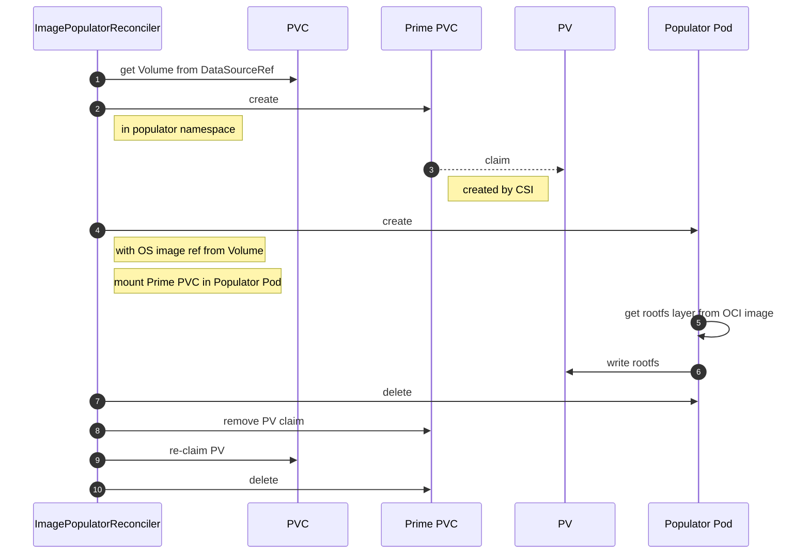

# Architecture

This section covers the core concepts of the `cephlet` project.

## Startup flow

Upon startup, the `cephlet` controller manager announces it's `VolumePool` in the cluster as configured by the following
flags:

```shell
--volume-pool-annotations  
      Annotations to apply to the volume pool upon startup. (default [])
--volume-pool-labels       
      Labels to apply to the volume pool upon startup. (default [])
--volume-pool-name         
      The name of the volume pool. (default "ceph")
--volume-pool-replication  
      The replication factor of the volume pool. (default 3)
```

The `VolumePool` indicates his supported `VolumeClasses` in the `.status.availableVolumeClasses` status field. This is
populated by the `VolumePoolReconciler` of the `cephlet`.



Which `VolumeClasses` should be supported by the announced `VolumePool` can be configured via the following flag

```shell
--volume-class-selector 
        Selector for volume classes to report as available. (default [])
```

## Volume Provisioning

The main task of the `cephlet` is to create Ceph block devices for every `Volume` in a given namespace.
[Rook](https://rook.io) provisions the `PVC` by creating in the background a ceph volume. 

The access credentials which are being extracted from the `CephClient`, created by the `VolumePool` controller, are stored in a `Secret` which is then referenced
in the status of the `Volume`.

The graph blow illustrates the relationships between the entities created in the reconciliation flow of a `Volume`.



The `VolumePool` is indicating the consumer of the storage API where a `Volume` can be created. The `cephlet` is announcing
its pool as configured and accumulates all supported `VolumeClasses` in the pool status. The mapping between a `VolumePool`
and Ceph is done via the creation of a `CephBlockPool`. 
The `cephlet` also creates a `StorageClass`, `VolumeSnapshotClass` and a `CephClient` for every `VolumePool`




## Limiting and pool utilization 

The `cephlet` support *absolute* and *relative* limits based on the `Volume` size. 

*Relative* limits: If the `Volume` has the `cephlet.onmetal.de/limitsPerGB` annotation the limits are calculated according the `Volume` size. Limits are taken from `VolumeClass` referenced by the `Volume` and multiplied by the `Volume` size. 

*Absolute* limits: Limits are taken from `VolumeClass` referenced by the `Volume` and applied with no further calculation.

The utilization of a `VolumePool` is exposed by a metric endpoint. The requested `IOPS` and `TPS` per `VolumePool` are available. 

## Image Population

Image population is a process in which we preload a certain payload onto a `PersistenVolume`. You can find more details 
on the process in the Kubernetes blog post on [Volume Populators](https://kubernetes.io/blog/2021/08/30/volume-populators-redesigned/).
Additionally, a sample implementation can be found in the [lib-volume-populator](https://github.com/kubernetes-csi/lib-volume-populator)
project.

In our case the population
is performed to load a root file system of an operating system (OS). That way we can boot a `Machine` from this block device 
later on.

The source of an OS is stored in the OCI format and is served from an OCI compliant registry.

Here is an example of a `Volume` manifest which references an OS image which should be populated

```yaml
apiVersion: storage.api.onmetal.de/v1alpha1
kind: Volume
metadata:
  name: sample-volume
  namespace: default 
spec:
  image: ghcr.io/onmetal/onmetal-image/gardenlinux:latest
  volumeClassRef:
    name: fast
  volumePoolRef:
    name: ceph
  resources:
    storage: 1Gi
```

The `VolumeReconciler` will create the following `PersistentVolumeClaim` out of this `Volume`

```yaml
apiVersion: v1
kind: PersistentVolumeClaim
metadata:
  name: sample-pvc
  namespace: default
spec:
  accessModes:
  - ReadWriteOnce
  resources:
    requests:
      storage: 1Gi
  dataSourceRef:
    apiGroup: storage.api.onmetal.de
    kind: Volume
    name: sample-volume
  volumeMode: Block
```

!!! note
    Only `volumeMode=block` is supported for image population as we will write the partition table and MBR. 

As soon as the PVC has been created, the `ImagePopulatorReconciler` starts the following flow to populate the underlying
`PersistenVolume` with the OS image root filesystem.



At the end of the `ImagePopulatorReconciler` flow we have a PVC which claims a PV which contains the root filesystem 
layout as of the OCI image.
