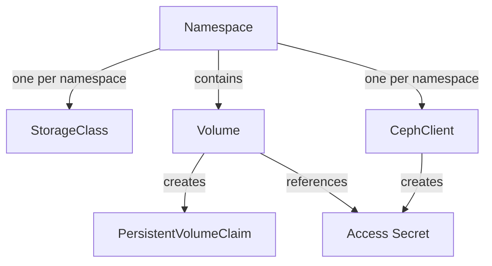
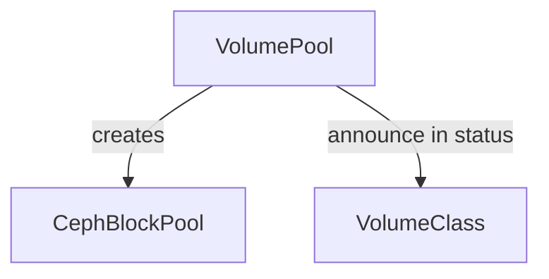

# Architecture

## Volume Provisioning

!!! note
    As Ceph does not support the creation of access secrets for each individual block devices, we chose to use Kubernetes `Namespace`s
    as a tenant separation. All `Volumes` within a `Namespace` belong essentially to one tenant.

The task of the `cephlet` is to create a Ceph block device for every `Volume` in a given namespace. Additionally,
for every `Namespace` an own `CephClient` and a corresponding `StorageClass` is created. The `StorageClass` is being used
to later create the `PersistentVolumeClaims` for a given `Namespace`. The access credentials which are being extracted
from the `CephClient` are stored in a `Secret` which is then referenced in the status of the `Volume`.

The graph blow illustrates the relationships between the entities created in the reconciliation flow of a `Volume`.

The `VolumePool` is indicating the consumer of the storage API where a `Volume` can be created. The `cephlet` is announcing
its pool as configured and accumulates all supported `VolumeClasses` in the pool status. The mapping between a `VolumePool`
and Ceph is done via the creation of a `CephBlockPool`.

## Image Population